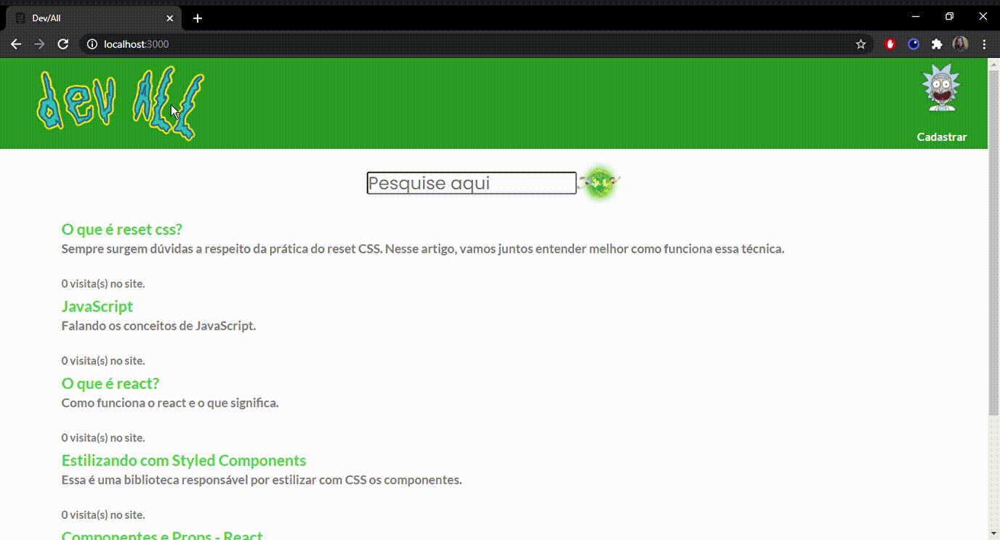

<h1 align="center">
    
    </img>
</h1>
<h1>
    
    </img>
</h1>

# Indice
- [Sobre](#-sobre)
- [Tecnologias utilizadas](#-tecnologias-utilizadas)
- [Sobre o sistema](#-sobre-o-sistema)

## 👀 Sobre

O projeto **Dev All** é um mecanismo de busca de sites já cadastrados, desenvolvido para o desafio da **itexto** o site foi inspirado na animação **Rick and Morty**.

---

## 💻 Tecnologias utilizadas

Foram utilizadas as seguintes tecnologias:

- [ReactJS](https://pt-br.reactjs.org/)
- [Sequelize](https://sequelize.org/)
- [Axios](https://github.com/axios/axios)
- [Babel](https://babeljs.io/)
- [MySql](https://www.mysql.com/)

---

## 📲 Sobre o sistema

No site você poderá realizar as seguintes funções:

- Cadastro de site
- Busca no site sobre determinado assunto (que já esteja cadastrado)

